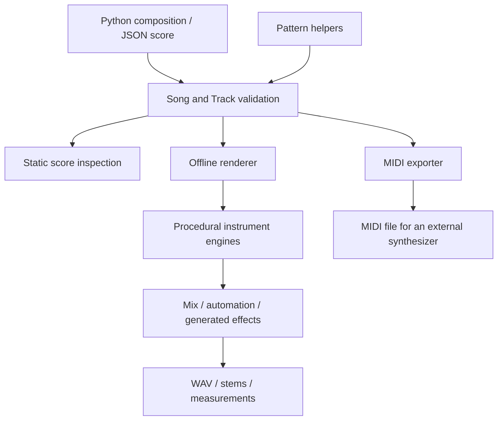

# Architecture

Audio as Code is a small Python library and CLI around a portable musical score.
It validates and renders a composition chosen by a person or coding agent. The core
does not call an LLM, require an audio device, or fetch instrument assets.

## Package boundaries

| Module | Responsibility |
| --- | --- |
| `__init__.py`, `__main__.py` | Public Python exports/version and `python -m audio_as_code` entry point. |
| `model.py` | Immutable Pydantic score objects, strict validation, pitch conversion, piecewise tempo integration, and release/effect-tail duration. |
| `pattern.py` | Explicit phrase length and composition transforms, including sequence, repeat, transpose, append, overlay, stretch, velocity scaling, and placement. |
| `instruments.py` | Central family/engine catalog, playable versus planned status, tone capabilities, and MIDI mappings. |
| `inspection.py` | Read-only facts and static WAV/MIDI readiness checks with structured issues; no synthesis or file writes. |
| `render.py` | Sample scheduling, voice routing, note envelopes, seeded synthesis, mixing, WAV/stem writing, and audio measurements. |
| `physical.py` | Original generated string and modal instrument models. |
| `orchestra.py` | Additional procedural instrument synthesis and source/filter approximations. |
| `_orchestra_profiles.py` | Private immutable instrument parameters shared by the orchestra models; keep numerical processing in `orchestra.py`. |
| `extended.py` | Paired-string mandolin, kalimba lamellae, celesta bars, and recorder jet-spectrum models. |
| `acoustics.py` | Shared generated excitations, modal/resonance utilities, and anti-alias helpers. |
| `automation.py`, `effects.py` | Gain/pan lane evaluation, finite generated delay/reverb, and effect-tail accounting. |
| `midi.py` | Type-1 Standard MIDI File export, tempo/program/pan mapping, note quantization, and channel/overlap checks. |
| `_paths.py` | Shared preflight for input/output aliases and conflicting output destinations. |
| `cli.py` | Argument handling, structured diagnostics, validation, inspection, rendering, export, and analysis commands. |
| `demo.py` | Small original composition used by the CLI demo. |

## Score and export contracts

Time is measured in quarter-note beats. `Song` contains ordered tracks and a seed;
notes have pitch, onset, duration, velocity, and optional release overrides. A
piecewise-constant tempo map converts beats to seconds. `Song.seconds` describes
the written score; `Song.render_seconds` includes releases and effect tails.

Piano-only `Track.pedal` events form a binary damper gate on the generated voices.
Ordered down/up events use score beats and apply before note-offs at the same beat;
captured notes decay until lift, with automatic lift at score end. Extended notes
receive a 0.12-second damper release unless overridden, included in render tails.
Empty pedal lists preserve existing score IDs and seeded output. MIDI preserves
written note times and exports CC64 127/0; receiver sound can differ. Shared legato,
half-pedaling and sympathetic resonance are not modeled. See [piano sustain](piano-sustain.md).

`schemas/song-v1.schema.json` is generated from `Song.model_json_schema()`. Runtime
checks additionally enforce unique track names, note bounds, supported controls,
and cross-field relationships. Schema version `"1"` is independent of package
version `0.1.0`. Breaking the score contract requires explicit version/migration
work; adding a Python helper does not automatically change the score schema.

Rendering revalidates scores and is limited to 300 seconds including tails. It
produces stereo float32 audio internally and 16-bit PCM WAV on export. Seeds are
derived deterministically from score/track/note context. Reproducibility is scoped
to a fixed environment; changing algorithms or numeric dependencies can change
samples. Reports include a score hash, engine/NumPy versions, duration, peak/RMS,
and clipping/silence measurements. These describe signals, not acoustic realism.

MIDI uses 480 ticks per beat and up to 15 melodic channels; percussion shares channel
10. It preserves notes and tempo on that grid, while tone controls, automation,
procedural effects and audio tails are not equivalent MIDI exports. Static inspection
can identify export blockers but does not replace the exporter's own checks.

CLI success normally returns one JSON object on stdout with exit status 0; failure
returns one JSON object on stderr with exit status 2. Help is plain text. Python
users receive models, reports and exceptions directly. See [the agent guide](agents.md)
for the command/issue contract and [the expressive engine](expressive-engine.md) for
timing and processing details.

## Source tree outside the engine

- `examples/` contains reproducible compositions and local site/catalog builders.
  `examples/music/` holds note data, provenance and notation; generated audio belongs
  under ignored `output/`. Classic-score importers are optional preparation tools.
- `docs/`, `schemas/`, and `skills/audio-as-code/` document the contracts for people
  and coding agents. `web/` supplies local listening-page templates and assets.
- `tests/` covers musical transforms, validation, audio/export behavior, CLI diagnostics,
  examples and distribution boundaries. `.github/` contains CI and contributor templates.
- The wheel ships the importable engine and CLI. The sdist and website source ZIP
  also carry examples, documentation, tests and build inputs. See [releasing](releasing.md).

## Adding capabilities

Keep musical policy in composition code and validation, shared scheduling in the
renderer, and instrument capabilities in `instruments.py`. Follow [the instrument
foundation](instrument-foundation.md) before adding a voice. Register a voice as
playable only when its synthesis exists, and expose only controls that affect it.
Do not substitute a generic oscillator while advertising an unimplemented instrument.

Keep the engine headless. New integrations belong outside the synthesis core unless
they are necessary to the score contract. Preserve stable IDs and default seeded
behavior; accompany intentional output changes with focused tests and an explanation.
